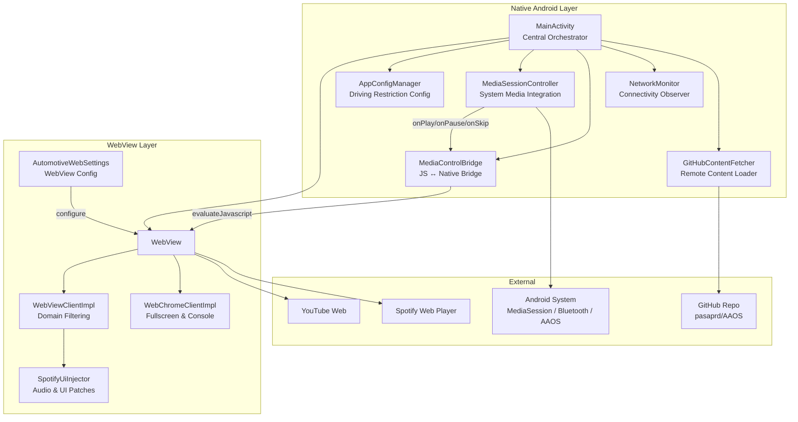
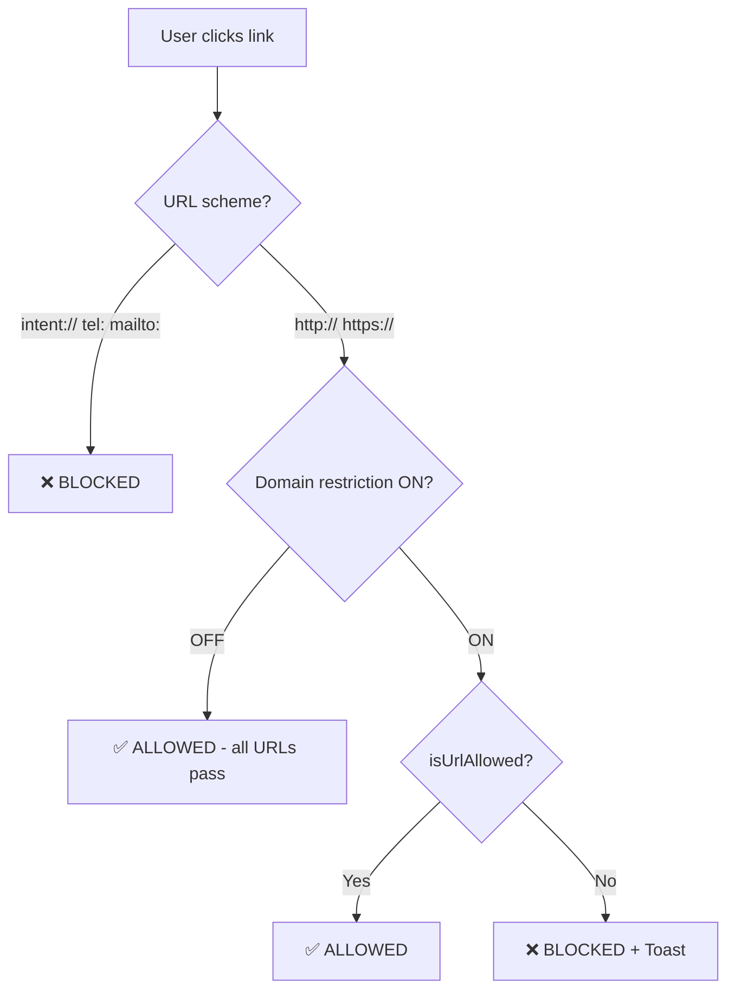
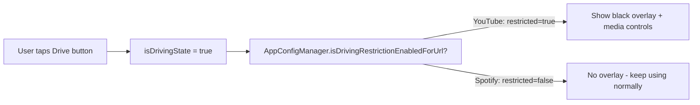
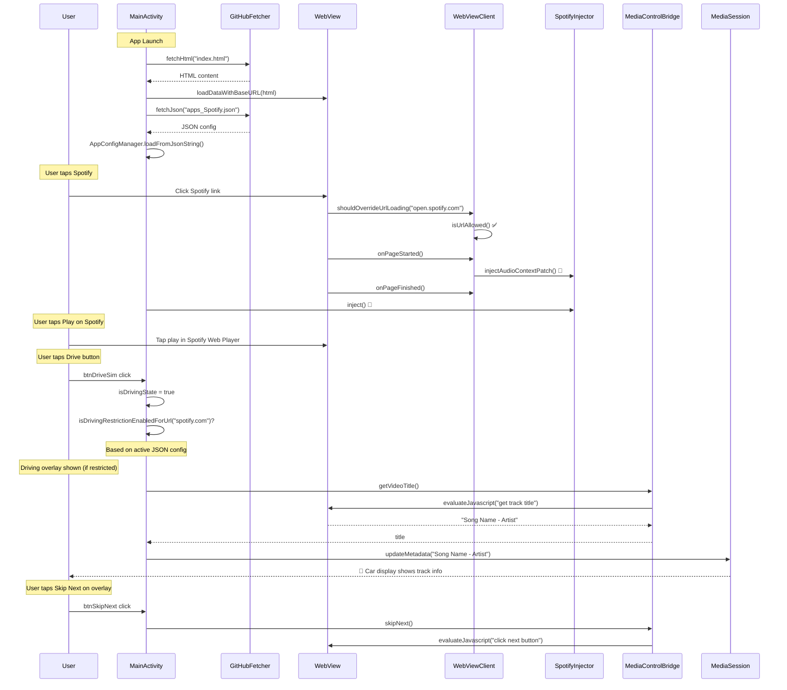

# How the AAOS WebView Media Hub Works

## What Is This App?

This is an **Android Automotive OS (AAOS) WebView-based media hub** — a native Android shell that hosts web applications (YouTube, Spotify) inside a WebView, adding automotive-specific features like driving restrictions, native media controls, domain security, and system media integration.

> [!NOTE]
> The app is designed for **in-vehicle infotainment (IVI) head units** running Android Automotive, but it also works on standard Android devices/emulators for development and demo purposes.

---

## Architecture Overview



---

## Component Breakdown

### 1. MainActivity — The Central Orchestrator
[MainActivity.kt](file:///home/pasap86/Documents/AAOS/webview%20project/Demo_html_media_controls/app/src/main/java/com/automotive/hub/webview/media/MainActivity.kt)

The hub that wires everything together. It manages:

| Responsibility | How |
|---|---|
| **App Launch** | Fetches remote HTML from GitHub → falls back to cached → falls back to local `R2_.html` |
| **Control Bar** | 10+ buttons: Home, Back, Forward, Refresh, Vol±, Drive/Park toggle, Domain toggle, Config toggle, Fullscreen |
| **Driving State** | Toggles between PARKED/DRIVING, shows/hides restriction overlay |
| **Audio Focus** | Requests Android audio focus for media playback |
| **Playback Polling** | Every 2s polls WebView for track title & play state while driving |

---

### 2. WebViewClientImpl — Domain Security Gate
[WebViewClientImpl.kt](file:///home/pasap86/Documents/AAOS/webview%20project/Demo_html_media_controls/app/src/main/java/com/automotive/hub/webview/media/WebViewClientImpl.kt)

Controls **what URLs the WebView is allowed to navigate to**. Every link click passes through `shouldOverrideUrlLoading()`:



**Domain whitelist per app:**

| Current App | Allowed Domains |
|---|---|
| **YouTube** | `youtube.com`, `googlevideo.com`, `ytimg.com`, `accounts.google.com`, `google.com` |
| **Spotify** | All domains (Spotify needs many service domains for auth, streaming, DRM) |
| **Home / Other** | All domains |

---

### 3. AppConfigManager — Driving Restriction Rules
[AppConfigManager.kt](file:///home/pasap86/Documents/AAOS/webview%20project/Demo_html_media_controls/app/src/main/java/com/automotive/hub/webview/media/AppConfigManager.kt)

Determines **which apps show the driving restriction overlay** when the vehicle is in motion.

- Reads from local `assets/apps.json` (default config)
- Can be overridden by remote JSON from GitHub (fetched by the 1st/2nd config toggle)
- The remote JSON lists app IDs that are **allowed while driving** (no overlay)



---

### 4. SpotifyUiInjector — Making Spotify Work in WebView
[SpotifyUiInjector.kt](file:///home/pasap86/Documents/AAOS/webview%20project/Demo_html_media_controls/app/src/main/java/com/automotive/hub/webview/media/SpotifyUiInjector.kt)

Spotify Web Player doesn't work out-of-the-box in Android WebView. This class injects JavaScript to fix it:

| Injection | When | What It Does |
|---|---|---|
| **AudioContext Patch** | `onPageStarted` (early) | Monkey-patches `AudioContext` constructor to auto-resume suspended contexts. WebViews suspend them by default — Spotify needs them active. |
| **Full Injection** | `onPageFinished` | Custom CSS for automotive-sized touch targets, JS to auto-click Spotify Connect prompts, monitor play button state, and retry playback setup |

---

### 5. MediaControlBridge — JS ↔ Native Bridge
[MediaControlBridge.kt](file:///home/pasap86/Documents/AAOS/webview%20project/Demo_html_media_controls/app/src/main/java/com/automotive/hub/webview/media/MediaControlBridge.kt)

Executes JavaScript inside the WebView to control media playback from native Android buttons. Supports both YouTube and Spotify:

| Action | Spotify Strategy | YouTube Strategy | Fallback |
|---|---|---|---|
| **Play/Pause** | Click `[data-testid="control-button-playpause"]` | Click `.ytp-play-button` | `<video>.play()` / `.pause()` |
| **Skip Next** | Click Spotify next button | Click YouTube next button | `<video>.currentTime += 10` |
| **Skip Previous** | Click Spotify prev button | Click YouTube prev button | `<video>.currentTime -= 10` |
| **Get Title** | Read `[data-testid="context-item-link"]` | Read `document.title` | `document.title` |

---

### 6. MediaSessionController — System Integration
[MediaSessionController.kt](file:///home/pasap86/Documents/AAOS/webview%20project/Demo_html_media_controls/app/src/main/java/com/automotive/hub/webview/media/MediaSessionController.kt)

Creates an Android `MediaSession` so the app integrates with:
- 🚗 AAOS media widget on the car's instrument cluster
- 🎵 Bluetooth car stereo controls (play/pause/skip)
- 📱 Android notification media controls
- 🎙️ Steering wheel buttons

When a hardware button is pressed → `MediaSession` callback → `MediaControlBridge` → JavaScript in WebView → Spotify/YouTube responds.

---

### 7. GitHubContentFetcher — Remote Content
[GitHubContentFetcher.kt](file:///home/pasap86/Documents/AAOS/webview%20project/Demo_html_media_controls/app/src/main/java/com/automotive/hub/webview/media/GitHubContentFetcher.kt)

Fetches files from the private GitHub repo `pasaprd/AAOS` using a PAT token:
- **`index.html`** — Remote home page (app launcher UI)
- **`apps_Spotify.json`** / **`apps_all.json`** — Driving restriction configs

Content is cached locally for offline use.

---

## Data Flow: App Launch to Playback



---

## Native Control Bar Layout

The control bar at the bottom is a horizontally scrollable strip of buttons:

```
┌─────┬──────┬───────┬────────┬──────┬────────┬──────┬───────────┬───────────┬──────────────┬──────────┬────────────┐
│ 🏠  │  ←   │  →    │  🔄   │ 🔉  │ 🔊 75% │ 🔊  │ Dashboard │ 🅿️ Parked │ 🔒 Domains ON│   1st    │ ⛶ Fullscreen│
│Home │ Back │Forward│Refresh │Vol-  │ Badge  │Vol+  │  Status   │Drive/Park │Domain Filter │JSON Cfg  │            │
└─────┴──────┴───────┴────────┴──────┴────────┴──────┴───────────┴───────────┴──────────────┴──────────┴────────────┘
```

### Toggle Buttons (tap to switch between 2 states):

| Button | State 1 (default) | State 2 |
|---|---|---|
| **Drive/Park** | 🅿️ Parked (green) | 🚘 Driving (red) |
| **Domain Filter** | 🔒 Domains ON (green) | 🔓 Domains OFF (red) |
| **JSON Config** | 1st (blue) | 2nd (green) |

---

## Key Features Summary

| Feature | Purpose |
|---|---|
| **Domain Restriction** | Prevents WebView from navigating to external/ad domains while inside YouTube or Spotify |
| **Driving Restriction Overlay** | Blacks out the screen while driving, shows native media controls only |
| **Spotify AudioContext Patch** | Fixes Spotify playback in WebView by auto-resuming suspended AudioContexts |
| **Native Media Controls** | Play/Pause, Skip, Now Playing — works from the driving overlay and system media buttons |
| **MediaSession Integration** | Exposes playback to AAOS instrument cluster, Bluetooth, steering wheel buttons |
| **Remote Config** | Loads home page HTML and driving restriction rules from GitHub, with local cache fallback |
| **Volume Controls** | Native volume up/down/mute with visual percentage badge |
| **Cinema Mode** | Hides control bar for fullscreen viewing |
| **Network Monitoring** | Auto-shows offline overlay when disconnected, auto-reloads when reconnected |
