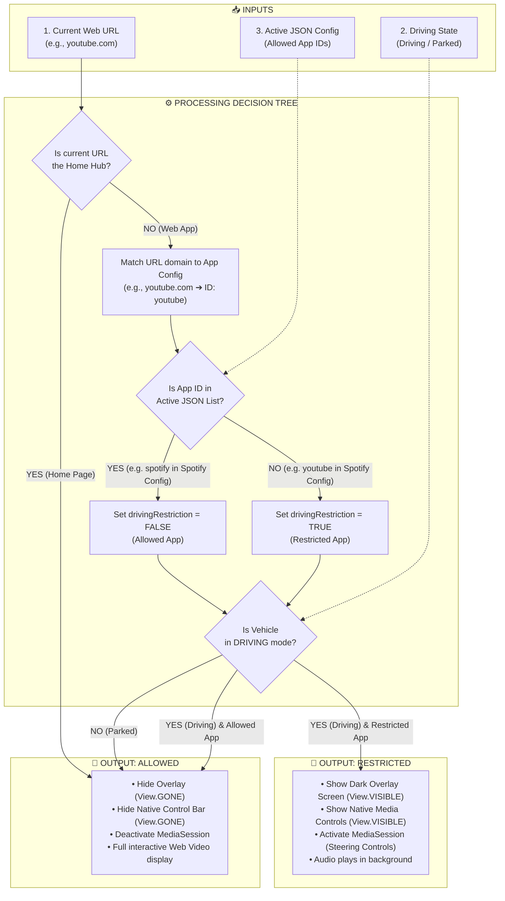

# Driving Restriction Input / Output Flowchart

This document details the complete Input, Processing, and Output logic for the AAOS WebView Media Hub's Driving Restriction Overlay mechanism.

## Visual Flowchart Diagram

---

## Mermaid Flowchart Definition

---

## Technical Summary of I/O Data Flow

### 1. Inputs
* **`currentUrl`**: The URL being navigated to inside the WebView.
* **`isDrivingState`**: Boolean flag set by the **Drive / Park Sim button**.
* **`allowedWhileDrivingIds`**: Set of App IDs parsed from the **JSON Config Toggle button** (`1st Config` or `2nd Config`).

### 2. Processing Steps
1. **Home Page Bypass**: If `isHomeUrl(currentUrl)` returns `true`, restriction is bypassed immediately.
2. **Domain Matching**: `AppConfigManager` matches `currentUrl` with the app's `domain` (e.g. `"youtube.com"` maps to `id: "youtube"`).
3. **JSON Lookup**: Checks if `allowedWhileDrivingIds` contains `"youtube"`. If not present, `drivingRestriction` is set to `true`.
4. **State Evaluation**: `isRestrictedApp = isDrivingState && drivingRestriction`.

### 3. Output States
* **Restricted (`isRestrictedApp == true`)**:
  * Dark Overlay Container: `View.VISIBLE`
  * Native Media Controls Bar: `View.VISIBLE`
  * MediaSession Controller: `activate()`
  * Playback: Background audio only
* **Allowed (`isRestrictedApp == false`)**:
  * Dark Overlay Container: `View.GONE`
  * Native Media Controls Bar: `View.GONE`
  * MediaSession Controller: `deactivate()`
  * Playback: Unrestricted video & web UI
